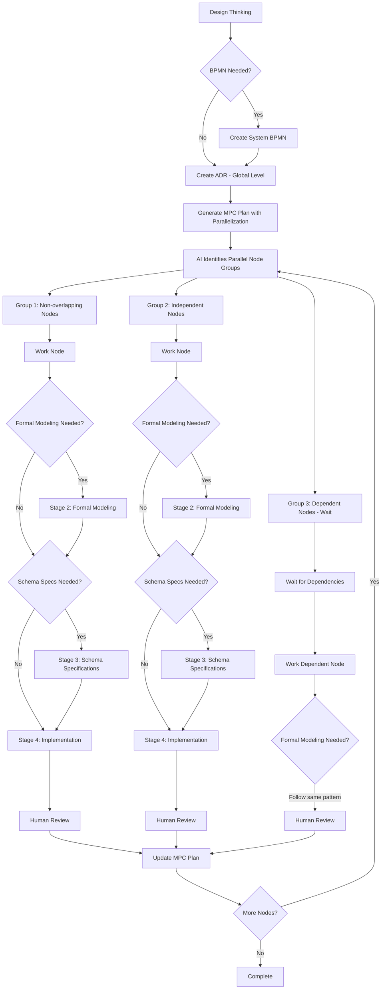

## MPC (Model Predictive Control) Philosophy
MPC plans a full trajectory, executes a single control input, then replans from the new state. Every node carries a 0-to-1 materialization score expressing execution confidence:

- **1.0**: Complete confidence - can execute exactly as planned
- **0.5**: Moderate confidence - known uncertainties exist  
- **0.1**: Low confidence - highly speculative, will likely change

The materialization score quantifies **planning confidence**, not implementation completeness.

## Core Workflow


## Phase 0: Design Thinking (Global)
Define the overall problem space, success criteria, and system-level goals before any technical decisions.

## Phase 1: Optional BPMN (System Level)
Create high-level BPMN if the system involves complex workflows or process orchestration.

### When BPMN is Required at Global MPC Plan Level
**BPMN Required for:**
- **Cross-functional processes** - Multiple teams/systems with handoffs
- **Regulated workflows** - Compliance requirements needing audit trails
- **Complex orchestration** - Multiple services with conditional routing
- **Event-driven architectures** - Async event flows between components
- **Integration patterns** - External system integrations with retries/fallbacks
- **Business process automation** - Multi-step approval flows or state machines

**BPMN NOT Required for:**
- Simple CRUD applications
- Single-service implementations
- Linear data transformations
- Stateless request/response APIs
- Pure computational tasks
- UI-only features

**Indicators to Use BPMN:**
- 3+ decision points in the workflow
- Multiple actors/systems involved
- Async operations with callbacks
- Error handling/compensation logic
- Time-based constraints or SLAs
- Parallel processing branches

## Phase 2: Architecture Decision Records (Global)
Create ADRs for significant architectural decisions:
- Technology choices (databases, frameworks)
- Architectural changes
- New patterns or conventions
- Long-term maintenance implications

Use: `/ai-adr-create`

## Phase 3: MPC Planning with Parallelization
The MPC plan identifies and prioritizes parallel work:
- **Independent nodes** worked simultaneously (e.g., CLI feature + auth system)
- **Dependent nodes** wait for prerequisites (e.g., docs wait for implementation)
- Varying materialization scores (1.0 for next step, decreasing for future)

Use: `/ai-generate-plan`

### Parallelization Examples
```yaml
# Can work in parallel - unrelated features
- id: "cli-feature"
  status: "Available"
  downstream: ["generate-docs"]

- id: "user-auth" 
  status: "Available"
  downstream: ["generate-docs"]

# Must wait - depends on implementation
- id: "generate-docs"
  status: "Blocked"  # Blocked until cli-feature and user-auth complete
  downstream: []
```

## Phase 4: Node Execution (Per Node)
### Artifact Requirements Guide
**BPMN Required for:**
- Multi-step workflows with decision points
- External system integrations
- State transitions or async operations

**Formal Specs Required for:**
- Critical business logic with invariants
- Security-sensitive operations
- Concurrent operations needing consistency

**Schemas Required for:**
- API endpoints with contracts
- Data models or database schemas
- Inter-service communication

### Stage 1: BPMN Process Design (Optional)
Create executable process diagrams with embedded schemas when needed.
Use: `/ai-bpmn-create <CONTEXT>``

### Stage 2: Formal Modeling (Optional)
Extract mathematical properties and generate test suites when the node requires formal verification.

Example:
```typescript
export const OrderFulfillmentSpec = {
  invariants: {
    "total matches items": (order) => 
      order.total === order.items.reduce((sum, item) => 
        sum + item.price * item.quantity, 0)
  },
  generators: {
    validOrder: fc.record({
      items: fc.array(orderItem, { minLength: 1 })
    }).map(order => ({
      ...order,
      total: calculateTotal(order.items)
    }))
  }
};
```

### Stage 3: Schema Specifications (Optional)
Create Zod/JSON schemas with validation contracts when the node involves data structures or APIs:

```typescript
export const OrderSchema = z.object({
  id: z.string().uuid(),
  items: z.array(OrderItemSchema).nonempty(),
  total: MoneySchema
}).refine(
  order => Math.abs(order.total - calculateTotal(order.items)) < 0.01,
  { message: "Order total doesn't match items sum" }
);
```

**IMPORTANT** At the end of Stage 3, the agent stops and waits for the human to review the generated output.

### Stage 4: Implementation
Implement to satisfy any schemas and tests created in previous stages.
Use: `/ai-nodes-implement`

### Stage 5: Human Review
After implementation, the agent waits for human review before proceeding to update the MPC plan and select next nodes.

## The Ralph Loop Integration
For autonomous implementation within Stage 4:

```bash
while [[ $(npm test -- --node="auth-endpoints") != "passing" ]]; do
  echo "Node: auth-endpoints" > CURRENT_CONTEXT.md
  cat docs/specs/auth-endpoints.yaml >> CURRENT_CONTEXT.md
  cat tests/auth-endpoints.test.ts >> CURRENT_CONTEXT.md
  cat CURRENT_CONTEXT.md | claude-code --implement-to-pass-tests
done
```

Ralph loops work best for:
- Single-node implementation after specs exist
- Iterative refinement to pass tests
- NOT for planning, design, or architectural decisions

## Best Practices
1. **Start High-Level** - Initial nodes should be capability-sized
2. **Embrace Evolution** - Plans adapt based on learnings
3. **Parallel Guidelines** - Spec together, implement after alignment
4. **Artifact Tracking** - Each node references its artifacts
5. **Session Boundaries** - Natural breaks after planning/spec/implementation

## Anti-Patterns
❌ **Big Bang Specification** - Don't spec entire system upfront
❌ **Rigid Plans** - MPC should evolve continuously
❌ **Skipping Stages** - Always spec before implementing
❌ **Over-Parallelization** - Limit concurrent work

## Summary
Testing is woven throughout the process, not a phase. This approach combines agile flexibility with formal rigor, ensuring correct implementation while maintaining adaptability.
