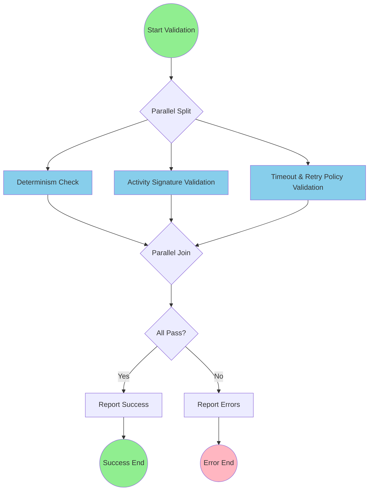

# Temporal Workflow Validation Framework

## Overview

The Temporal Workflow Validation Framework is a BPMN 2.0 process that provides comprehensive validation for Temporal workflows. It performs three parallel validation checks to ensure workflow determinism, validate activity signatures, and verify timeout/retry policies.

## Process Information

- **Process ID**: `temporal-validation-framework`
- **Process Name**: Temporal Workflow Validation Framework
- **Type**: Private, Executable
- **Trigger**: Manual trigger via justfile command (e.g., `just validate-workflows`)
- **Output**: Validation results to stdout

## Process Flow Visualization



## Process Steps

### 1. Start Event
- **ID**: `start-validation`
- **Type**: Manual trigger
- **Description**: Developer initiates validation via justfile command
- **Next**: Parallel Gateway (Split)

### 2. Parallel Gateway (Split)
- **ID**: `parallel-split`
- **Type**: Parallel Gateway (AND)
- **Direction**: Diverging
- **Description**: Opens three parallel validation paths for concurrent execution
- **Outputs**: Three parallel validation tasks

### 3. Parallel Validation Tasks

#### 3.1 Determinism Check Task
- **ID**: `determinism-check`
- **Type**: Service Task (Automated)
- **Agent**: System
- **Implementation**: `go.temporal.io/sdk/contrib/workflowcheck`
- **Description**: Validates workflow determinism to prevent replay failures
- **Checks For**:
  - Non-deterministic random number usage
  - System time dependencies
  - Non-deterministic map iterations
  - External API calls without proper handling
- **Output**: Pass/Fail with detailed error messages

#### 3.2 Activity Signature Validation Task
- **ID**: `activity-signature-validation`
- **Type**: Service Task (Automated)
- **Agent**: System
- **Implementation**: Runtime signature validator
- **Description**: Validates activity signatures at runtime
- **Checks For**:
  - Type mismatches between workflow and activity definitions
  - Missing required parameters
  - Invalid return types
  - Incompatible activity options
- **Output**: Pass/Fail with type mismatch errors

#### 3.3 Timeout & Retry Policy Validation Task
- **ID**: `timeout-retry-validation`
- **Type**: Service Task (Automated)
- **Agent**: System
- **Implementation**: Configuration policy validator
- **Description**: Validates timeout configurations and retry policies
- **Checks For**:
  - Invalid timeout durations
  - Conflicting retry policies
  - Missing required timeouts
  - Excessive retry attempts
- **Output**: Pass/Fail with configuration errors

### 4. Parallel Gateway (Join)
- **ID**: `parallel-join`
- **Type**: Parallel Gateway (AND)
- **Direction**: Converging
- **Description**: Waits for all three validation tasks to complete
- **Behavior**: Fast-fail - proceeds immediately to error handling if any validation fails

### 5. Exclusive Gateway (Decision)
- **ID**: `validation-decision`
- **Type**: Exclusive Gateway (XOR)
- **Direction**: Diverging
- **Decision Logic**:
  - If all validations pass → Success path
  - If any validation fails → Error path
- **Condition Expression**: `determinismResult.passed && signatureResult.passed && policyResult.passed`

### 6. Result Reporting

#### 6.1 Success Path
- **Task ID**: `report-success`
- **Type**: Service Task (Automated)
- **Agent**: System
- **Implementation**: stdout reporter
- **Output**: "✅ All Temporal workflow validations passed"
- **Next**: Success End Event

#### 6.2 Error Path
- **Task ID**: `report-errors`
- **Type**: Service Task (Automated)
- **Agent**: System
- **Implementation**: Error reporter
- **Output**: Detailed error report with:
  - List of all validation failures
  - Actionable feedback for each error
  - Suggested fixes
- **Next**: Error End Event

### 7. End Events

#### 7.1 Success End Event
- **ID**: `end-success`
- **Type**: End Event
- **Description**: Validation completed successfully
- **Exit Code**: 0

#### 7.2 Error End Event
- **ID**: `end-error`
- **Type**: Error End Event
- **Description**: Validation failed with errors
- **Exit Code**: 1

## Non-Functional Requirements

### Performance
- All validation tasks run in parallel for optimal performance
- Fast-fail behavior ensures quick feedback on first error
- Typical execution time: < 5 seconds for standard workflows

### Reliability
- Fully automated with no human intervention required
- Deterministic validation results
- Comprehensive error handling

### Integration
- Seamless integration with justfile commands
- Results output to stdout for easy parsing
- Compatible with CI/CD pipelines

### Extensibility
- Modular design allows adding new validation types
- AI assistance for validation can be added in future iterations
- Part of larger Temporal workflow implementation project

## Process Metrics

- **Complexity Score**: 21
- **Process Depth**: 7 steps
- **Process Width**: 3 parallel paths
- **Connectivity**: 1.09
- **Total Elements**: 11
  - Events: 3
  - Activities: 5
  - Gateways: 3
  - Sequence Flows: 12

## Usage Example

```bash
# Run validation via justfile
just validate-workflows

# Expected output for success:
# ✅ All Temporal workflow validations passed

# Expected output for failure:
# ❌ Validation failed:
# - Determinism Check: Non-deterministic use of time.Now() in workflow
# - Activity Signature: Type mismatch in ProcessOrder activity
# - Timeout Policy: Missing ScheduleToClose timeout for LongRunningActivity
```

## Error Messages and Resolution

### Determinism Errors
```
Error: Non-deterministic code detected
Location: workflow.go:45
Issue: Use of math/rand without seed
Fix: Use workflow.Now() and workflow.NewRandom()
```

### Signature Validation Errors
```
Error: Activity signature mismatch
Activity: ProcessPayment
Expected: func(ctx context.Context, amount float64) error
Found: func(ctx context.Context, amount int) error
Fix: Update activity signature to match registration
```

### Timeout/Retry Policy Errors
```
Error: Invalid retry policy
Activity: SendEmail
Issue: MaximumAttempts set to -1
Fix: Set MaximumAttempts to a positive value or 0 for unlimited
```

## Integration Notes

### Justfile Integration
The validation framework is invoked via justfile commands:
```makefile
validate-workflows:
    @echo "Running Temporal workflow validation..."
    @./workflows bpmn execute definitions/bpmn/temporal-validation-framework.json
```

### CI/CD Pipeline Integration
Can be integrated into CI/CD pipelines:
```yaml
- name: Validate Temporal Workflows
  run: just validate-workflows
  continue-on-error: false
```

### Future Enhancements
1. **AI-Assisted Validation**: Add AI agent to suggest fixes for validation errors
2. **Custom Validation Rules**: Allow project-specific validation rules
3. **Performance Benchmarking**: Add performance validation for activities
4. **Visual Reports**: Generate HTML reports with validation results
5. **Incremental Validation**: Only validate changed workflows

## Related Documentation
- [BPMN Concepts Guide](../bpmn-concepts.md)
- [Temporal Workflow Best Practices](https://docs.temporal.io/best-practices)
- [Workflow Determinism Guide](https://docs.temporal.io/workflows#determinism)
