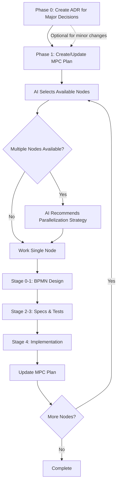

# Spec Driven Design Overview
## Core Workflow



## Phase-by-Phase Guide
### Phase 0: Architecture Decision Record (ADR)

1. **Use the AI-assisted workflow** for guided ADR creation
In Claude Code:
   ```bash
   /ai-adr-create
   ```

### Phase 1: MPC (Model Predictive Control) Planning

1. **Use the AI-assisted workflow** for guided MPC (Model Predictive Control) plan creation:
In Claude Code:
   ```bash
   /ai-generate-plan
   ```

### Phase 2: Spec Driven Design Process
For each node available to work next:

#### Step 0: Generate a BPMN 2.0 Definition
In Claude Code:
   ```bash
   /ai-bpmn-create <NODE_NAME>
   ```
#### Step 1: Formal Specs & Tests
In Claude Code:
   ```bash
   TBD
   ```
#### Step 2: Implementation
In Claude Code:
   ```bash
   /ai-nodes-implement
   ```

### Phase 3: Continuous Plan Evolution
After completing nodes the ai agent will:

0. **Test implementation against schemas**
1. **Update downstream nodes** with concrete interfaces
2. **Adjust materialization** based on new clarity
3. **Split or merge nodes** based on implementation insights
4. **Add new nodes** for discovered requirements

## Summary
The integration works by using MPC for **work decomposition and prioritization**, while Spec Driven Design ensures **quality and correctness** for each work item. The AI acts as:

1. **Strategic Planner**: Maintains and evolves the MPC plan
2. **Methodology Enforcer**: Ensures Spec Driven Design stages aren't skipped
3. **Parallel Coordinator**: Identifies safe parallelization opportunities
4. **Context Keeper**: Maintains relationships between specs and implementations

This combination provides both the flexibility of agile planning and the rigor of formal specification.
