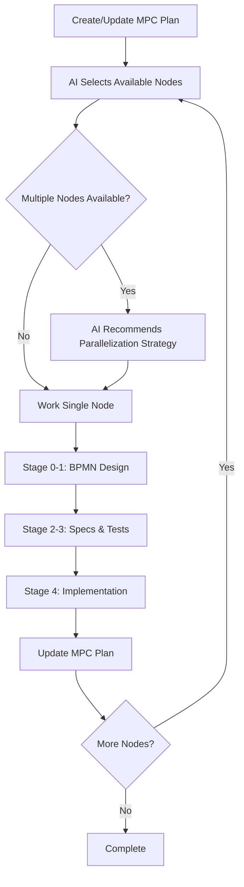

# MPC + Spec Driven Design Integration

## Overview

This document describes how Model Predictive Control (MPC) planning integrates with Spec
Driven Design methodology. MPC provides the high-level task decomposition and work
prioritization, while Spec Driven Design ensures each task is properly specified, tested,
and implemented.

## Core Workflow



## Phase-by-Phase Guide

### Phase 1: Initial MPC Planning

The MPC plan serves as the **work breakdown structure** with these characteristics:

- **Low initial materialization** (0.3-0.5) for most nodes
- **High-level descriptions** that will be refined during spec design
- **Clear dependencies** to enable parallel work
- **Flexible structure** that can evolve as understanding deepens

Example initial node:
```yaml
- id: "auth-system"
  status: "Blocked"
  materialization: 0.4
  description: "Implement authentication system"
  detailed_description: |
    Create a secure authentication system supporting:
    - Username/password login
    - JWT tokens
    - Session management
    Need to determine: MFA approach, token storage, refresh strategy
  outputs: ["src/auth/*", "tests/auth/*"]
  agent_action: "Design and implement authentication"
  downstream: ["user-api", "admin-panel"]
```

### Phase 2: Intelligent Node Selection

When multiple nodes are available, the AI considers:

1. **Dependency Analysis**
   - Can truly work in parallel without blocking
   - Shared interfaces need coordination

2. **Context Efficiency**
   - Similar domains benefit from batch processing
   - Example: "auth-endpoints" + "user-model" share context

3. **Risk Distribution**
   - Don't parallelize all high-risk items
   - Balance exploration vs. execution

4. **Developer Capacity**
   - How many parallel specs can you review?
   - Typical recommendation: 1-3 nodes per session

### Phase 3: Spec Driven Design Process

For each selected node:

#### Stage 0-1: Refinement Through BPMN
```yaml
# MPC node update after BPMN modeling
- id: "auth-system"
  status: "Ready"
  materialization: 0.7  # Increased after clarification
  description: "Implement JWT-based authentication"
  detailed_description: |
    REFINED: Create JWT authentication with:
    - POST /auth/login - Password validation with rate limiting
    - POST /auth/refresh - Token refresh with rotation
    - POST /auth/logout - Token revocation
    - MFA via TOTP (separate future node)
    
    See: docs/bpmn/auth-flow.json
    See: docs/specs/auth-endpoints.yaml
```

#### Discovery Leads to Plan Updates
During BPMN modeling, you might discover:
- Node is too large → Split into multiple nodes
- Missing dependency → Add new upstream node
- Scope creep → Create follow-up nodes for v2 features

Example split:
```yaml
# Original node becomes two:
- id: "auth-basic"
  description: "Basic JWT authentication"
  downstream: ["auth-mfa"]
  
- id: "auth-mfa"
  description: "Multi-factor authentication"
  status: "Blocked"  # Waiting on auth-basic
```

#### Stage 2-3: Formal Specs & Tests
Node artifacts accumulate:
```yaml
- id: "auth-basic"
  materialization: 0.9  # Almost ready for implementation
  artifacts:
    bpmn: "docs/bpmn/auth-flow.json"
    spec: "docs/specs/auth-endpoints.yaml"
    tests: "tests/generated/auth/*.test.ts"
    properties: "tests/properties/auth.properties.ts"
```

#### Stage 4: Implementation
Only after all specs and tests exist:
```yaml
- id: "auth-basic"
  status: "Completed"
  materialization: 1.0
  implementation_complete: "2024-03-15"
  pr_link: "https://github.com/org/repo/pull/123"
```

### Phase 4: Continuous Plan Evolution

After completing nodes:

1. **Update downstream nodes** with concrete interfaces
2. **Adjust materialization** based on new clarity
3. **Split or merge nodes** based on implementation insights
4. **Add new nodes** for discovered requirements

## Working Session Examples

### Session 1: Initial Planning
```
Developer: "I need to build a secure API for user management"

AI: "Let's start with an MPC plan to break this down..."
[Creates plan with 8 nodes: auth, user-model, user-api, admin-api, etc.]

AI: "I see three nodes are immediately available:
     1. 'project-setup' - Basic structure (low risk, do first)
     2. 'user-model' - Data schema (needed by many others)  
     3. 'auth-system' - Complex but independent
     
     I recommend starting with 'project-setup' alone since it's quick,
     then we can work 'user-model' and 'auth-system' in parallel.
     Which would you like to tackle?"
```

### Session 2: Parallel Spec Development
```
Developer: "Let's do user-model and auth-system in parallel"

AI: "Good choice - these have shared concepts we can align. 
     Starting Stage 1 BPMN for both...
     
     [BPMN for user-model reveals need for audit fields]
     [BPMN for auth reveals need for user status field]
     
     I notice these intersect at the User entity. Let's ensure
     compatible designs..."

[AI guides through both specs, ensuring alignment]

AI: "Both nodes now have complete specs and tests. You can:
     1. Implement both yourself
     2. Have me implement while you review
     3. Split - you take one, I take the other"
```

### Session 3: Plan Adaptation
```
Developer: "The auth implementation revealed we need rate limiting"

AI: "I'll update the MPC plan. This affects several areas:
     
     1. Adding new node: 'rate-limiting-middleware'
     2. Updated dependencies: 
        - 'auth-system' now depends on 'rate-limiting-middleware'
        - 'api-gateway' also needs this dependency
     3. Adjusted materialization:
        - Downstream nodes reduced to 0.5 due to new dependency
     
     The rate limiting node is now the highest priority."
```

## Best Practices

### 1. Start High-Level
- Initial MPC nodes should be "capability-sized" not "function-sized"
- Detail emerges through the Spec Driven Design process

### 2. Embrace Plan Evolution  
- The MPC plan is a living document
- Each implementation teaches you something
- Refactor the plan based on learnings

### 3. Parallel Work Guidelines
- Spec multiple nodes together when they share domain context
- Implement in parallel only after specs are aligned
- Use the AI to identify and prevent interface conflicts

### 4. Artifact Tracking
Each node should reference its artifacts:
```yaml
artifacts:
  problem_statement: "docs/problems/auth-problem.md"
  bpmn: "docs/bpmn/auth-flow.json"
  spec: "docs/specs/auth-endpoints.yaml"
  tests: "tests/auth/*"
  implementation: "src/auth/*"
```

### 5. Session Boundaries
Natural session breaks:
- After MPC planning/replanning
- After spec completion (before implementation)
- After implementation (before replanning)

## Anti-Patterns to Avoid

### ❌ Big Bang Specification
Don't try to spec the entire system before starting implementation.

### ❌ Rigid MPC Plans
Don't treat the MPC plan as fixed - it should evolve.

### ❌ Skipping Stages
Don't jump to implementation without specs, even for "simple" nodes.

### ❌ Over-Parallelization
Don't work on too many nodes at once - context switching hurts quality.

## Summary

The integration works by using MPC for **work decomposition and prioritization**, while Spec Driven Design ensures **quality and correctness** for each work item. The AI acts as:

1. **Strategic Planner**: Maintains and evolves the MPC plan
2. **Methodology Enforcer**: Ensures Spec Driven Design stages aren't skipped  
3. **Parallel Coordinator**: Identifies safe parallelization opportunities
4. **Context Keeper**: Maintains relationships between specs and implementations

This combination provides both the flexibility of agile planning and the rigor of formal specification.
