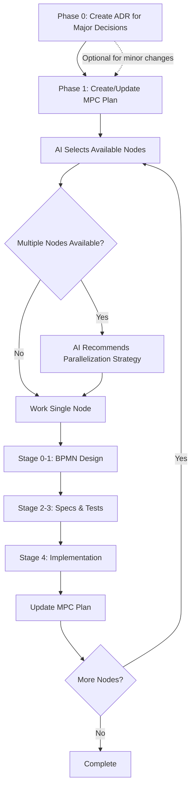

# ADR + MPC + Spec Driven Design Integration

## Overview

This document describes how Architecture Decision Records (ADRs), Model Predictive Control 
(MPC) planning, and Spec Driven Design methodology work together. ADRs capture major 
architectural decisions, MPC provides the high-level task decomposition and work 
prioritization, while Spec Driven Design ensures each task is properly specified, tested,
and implemented.

## Core Workflow



## Phase-by-Phase Guide

### Phase 0: Architecture Decision Record (ADR)

Before diving into MPC planning, significant architectural decisions should be documented using an ADR. This ensures:

- **Clear rationale** for major technical choices
- **Stakeholder alignment** before implementation begins
- **Future reference** for understanding why decisions were made
- **Risk assessment** of architectural impacts

#### When to Create an ADR

Create an ADR when:
- Choosing between multiple technology options (databases, frameworks, libraries)
- Making significant architectural changes
- Establishing new patterns or conventions
- Decisions that affect multiple components or teams
- Changes with long-term maintenance implications

#### ADR Creation Process

1. **Use the AI-assisted workflow** for guided ADR creation in Claude Code:
   ```bash
   /ai-adr-create
   ```

#### Example ADR-Driven Planning

```
Developer: "We need to add real-time features to our application"

AI: "This is a significant architectural decision. Let's create an ADR first to evaluate options.
     
     Key decisions to document:
     1. WebSocket vs Server-Sent Events vs Long Polling
     2. Scaling strategy for real-time connections
     3. Message broker selection if needed
     
     Shall we start with the ADR creation?"

[Creates ADR-0024-real-time-architecture.json]
```

### Phase 1: MPC (Model Predictive Control) Planning

The MPC plan serves as the **work breakdown structure** with these characteristics:

- **Low initial materialization** (0.3-0.7) for most nodes
- **High-level descriptions** that will be refined during spec design
- **Clear dependencies** to enable parallel work
- **Flexible structure** that can evolve as understanding deepens

Example node:
```yaml
  - id: "add-oauth-support"
    status: "Blocked"
    materialization: 0.5
    description: "Integrate OAuth2.0 providers"
    detailed_description: |
      Extend the authentication system to support third-party OAuth providers, initially focusing on Google and GitHub. This includes implementing OAuth flows, managing external user identities, and providing seamless account linking between OAuth and local accounts.
    subtasks:
      - description: "Configure and implement Google OAuth support"
        completed: false
      - description: "Configure and implement GitHub OAuth support"
        completed: false
      - description: "Implement OAuth callback handlers"
        completed: false
      - description: "Create logic to link OAuth accounts to local users"
        completed: false
      - description: "Implement secure OAuth token storage"
        completed: false
    outputs: ["src/strategies/oauth.ts", "src/routes/oauth.ts"]
    acceptance_criteria:
      - "OAuth flow completes successfully"
      - "Users can link multiple OAuth accounts"
    definition_of_done: "OAuth login working for Google and GitHub"
    required_knowledge: ["OAuth2.0", "Passport OAuth strategies"]
    # NOTE: Artifacts will be generated in subsequent phases
    # artifacts:
    #   bpmn: "docs/bpmn/oauth-flow.json"
    #   spec: "docs/specs/oauth-integration.yaml"
    #   tests: "tests/oauth/*"
    downstream: ["write-integration-tests"]
```

### Phase 2: Intelligent Node Selection

When multiple nodes are available, the AI considers:

1. **Dependency Analysis**
   - Can truly work in parallel without blocking
   - Shared interfaces need coordination

2. **Context Efficiency**
   - Similar domains benefit from batch processing
   - Example: "auth-endpoints" + "user-model" share context

3. **Risk Distribution**
   - Don't parallelize all high-risk items
   - Balance exploration vs. execution

4. **Developer Capacity**
   - How many parallel specs can you review?
   - Typical recommendation: 1-3 nodes per session

### Phase 3: Spec Driven Design Process

For each selected node:

#### Stage 0-1: Refinement Through BPMN
```yaml
# MPC node update after BPMN modeling
- id: "add-oauth-support"
  status: "Ready"  # Changed from Blocked after dependencies resolved
  materialization: 0.7  # Increased after clarification
  description: "Integrate OAuth2.0 providers"
  detailed_description: |
    REFINED: Extend the authentication system to support third-party OAuth providers, initially focusing on Google and GitHub. This includes implementing OAuth flows, managing external user identities, and providing seamless account linking between OAuth and local accounts.
    
    Key clarifications from BPMN:
    - OAuth callback flow requires dedicated endpoints
    - Token storage needs encryption at rest
    - Account linking requires user confirmation step
  subtasks:
    - description: "Configure and implement Google OAuth support"
      completed: false
    - description: "Configure and implement GitHub OAuth support"
      completed: false
    - description: "Implement OAuth callback handlers"
      completed: false
    - description: "Create logic to link OAuth accounts to local users"
      completed: false
    - description: "Implement secure OAuth token storage"
      completed: false
  outputs: ["src/strategies/oauth.ts", "src/routes/oauth.ts"]
  acceptance_criteria:
    - "OAuth flow completes successfully"
    - "Users can link multiple OAuth accounts"
  definition_of_done: "OAuth login working for Google and GitHub"
  required_knowledge: ["OAuth2.0", "Passport OAuth strategies"]
  artifacts:
    bpmn: "docs/bpmn/oauth-flow.json"
    # spec: "docs/specs/oauth-integration.yaml"  # Next phase
    # tests: "tests/oauth/*"  # Next phase
  downstream: ["write-integration-tests"]
```

#### Discovery Leads to Plan Updates
During BPMN modeling, you might discover:
- Node is too large →  Split into multiple nodes
- Missing dependency →  Add new upstream node
- Scope creep →  Create follow-up nodes for v2 features

Example split:
```yaml
# Original node becomes two:
- id: "auth-basic"
  status: "Ready"
  materialization: 0.6
  description: "Basic JWT authentication"
  detailed_description: |
    Implement core JWT-based authentication system with login, logout, and token refresh capabilities.
  subtasks:
    - description: "Implement JWT token generation and validation"
      completed: false
    - description: "Create login endpoint with password validation"
      completed: false
    - description: "Implement token refresh mechanism"
      completed: false
  acceptance_criteria:
    - "Users can login with valid credentials"
    - "JWT tokens are properly validated"
    - "Token refresh works correctly"
  definition_of_done: "Basic authentication flow working end-to-end"
  downstream: ["auth-mfa"]
  
- id: "auth-mfa"
  status: "Blocked"  # Waiting on auth-basic
  materialization: 0.3
  description: "Multi-factor authentication"
  detailed_description: |
    Add TOTP-based multi-factor authentication to the existing auth system.
  subtasks:
    - description: "Implement TOTP secret generation"
      completed: false
    - description: "Add MFA enrollment endpoints"
      completed: false
    - description: "Integrate MFA into login flow"
      completed: false
  acceptance_criteria:
    - "Users can enable/disable MFA"
    - "MFA codes are properly validated"
    - "Recovery codes work correctly"
  definition_of_done: "MFA fully integrated with auth system"
  downstream: []
```

#### Stage 2-3: Formal Specs & Tests
Node artifacts accumulate:
```yaml
- id: "add-oauth-support"
  status: "Ready"
  materialization: 0.9  # Almost ready for implementation
  description: "Integrate OAuth2.0 providers"
  detailed_description: |
    REFINED: Extend the authentication system to support third-party OAuth providers, initially focusing on Google and GitHub. This includes implementing OAuth flows, managing external user identities, and providing seamless account linking between OAuth and local accounts.
    
    Key clarifications from BPMN:
    - OAuth callback flow requires dedicated endpoints
    - Token storage needs encryption at rest
    - Account linking requires user confirmation step
  subtasks:
    - description: "Configure and implement Google OAuth support"
      completed: false
    - description: "Configure and implement GitHub OAuth support"
      completed: false
    - description: "Implement OAuth callback handlers"
      completed: false
    - description: "Create logic to link OAuth accounts to local users"
      completed: false
    - description: "Implement secure OAuth token storage"
      completed: false
  outputs: ["src/strategies/oauth.ts", "src/routes/oauth.ts"]
  acceptance_criteria:
    - "OAuth flow completes successfully"
    - "Users can link multiple OAuth accounts"
  definition_of_done: "OAuth login working for Google and GitHub"
  required_knowledge: ["OAuth2.0", "Passport OAuth strategies"]
  artifacts:
    bpmn: "docs/bpmn/oauth-flow.json"
    spec: "docs/specs/oauth-integration.yaml"
    tests: "tests/oauth/*"
    properties: "tests/properties/oauth.properties.ts"
  downstream: ["write-integration-tests"]
```

#### Stage 4: Implementation
Only after all specs and tests exist:
```yaml
- id: "add-oauth-support"
  status: "Completed"
  materialization: 1.0
  description: "Integrate OAuth2.0 providers"
  detailed_description: |
    REFINED: Extend the authentication system to support third-party OAuth providers, initially focusing on Google and GitHub. This includes implementing OAuth flows, managing external user identities, and providing seamless account linking between OAuth and local accounts.
    
    Key clarifications from BPMN:
    - OAuth callback flow requires dedicated endpoints
    - Token storage needs encryption at rest
    - Account linking requires user confirmation step
  subtasks:
    - description: "Configure and implement Google OAuth support"
      completed: true
    - description: "Configure and implement GitHub OAuth support"
      completed: true
    - description: "Implement OAuth callback handlers"
      completed: true
    - description: "Create logic to link OAuth accounts to local users"
      completed: true
    - description: "Implement secure OAuth token storage"
      completed: true
  outputs: ["src/strategies/oauth.ts", "src/routes/oauth.ts"]
  acceptance_criteria:
    - "OAuth flow completes successfully"
    - "Users can link multiple OAuth accounts"
  definition_of_done: "OAuth login working for Google and GitHub"
  required_knowledge: ["OAuth2.0", "Passport OAuth strategies"]
  artifacts:
    bpmn: "docs/bpmn/oauth-flow.json"
    spec: "docs/specs/oauth-integration.yaml"
    tests: "tests/oauth/*"
    properties: "tests/properties/oauth.properties.ts"
  downstream: ["write-integration-tests"]
  # Additional fields after completion:
  implementation_complete: "2024-03-15"
  pr_link: "https://github.com/org/repo/pull/123"
```

### Phase 4: Continuous Plan Evolution

After completing nodes:

1. **Update downstream nodes** with concrete interfaces
2. **Adjust materialization** based on new clarity
3. **Split or merge nodes** based on implementation insights
4. **Add new nodes** for discovered requirements

## Working Session Examples

### Session 1: Initial Planning
```
Developer: "I need to build a secure API for user management"

AI: "Let's start with an MPC plan to break this down..."
[Creates plan with 8 nodes: auth, user-model, user-api, admin-api, etc.]

AI: "I see three nodes are immediately available:
     1. 'project-setup' - Basic structure (low risk, do first)
     2. 'user-model' - Data schema (needed by many others)  
     3. 'auth-system' - Complex but independent
     
     I recommend starting with 'project-setup' alone since it's quick,
     then we can work 'user-model' and 'auth-system' in parallel.
     Which would you like to tackle?"
```

### Session 2: Parallel Spec Development
```
Developer: "Let's do user-model and auth-system in parallel"

AI: "Good choice - these have shared concepts we can align. 
     Starting Stage 1 BPMN for both...
     
     [BPMN for user-model reveals need for audit fields]
     [BPMN for auth reveals need for user status field]
     
     I notice these intersect at the User entity. Let's ensure
     compatible designs..."

[AI guides through both specs, ensuring alignment]

AI: "Both nodes now have complete specs and tests. You can:
     1. Implement both yourself
     2. Have me implement while you review
     3. Split - you take one, I take the other"
```

### Session 3: Plan Adaptation
```
Developer: "The auth implementation revealed we need rate limiting"

AI: "I'll update the MPC plan. This affects several areas:
     
     1. Adding new node: 'rate-limiting-middleware'
     2. Updated dependencies: 
        - 'auth-system' now depends on 'rate-limiting-middleware'
        - 'api-gateway' also needs this dependency
     3. Adjusted materialization:
        - Downstream nodes reduced to 0.5 due to new dependency
     
     The rate limiting node is now the highest priority."
```

## Best Practices

### 1. Start High-Level
- Initial MPC nodes should be "capability-sized" not "function-sized"
- Detail emerges through the Spec Driven Design process

### 2. Embrace Plan Evolution  
- The MPC plan is a living document
- Each implementation teaches you something
- Refactor the plan based on learnings

### 3. Parallel Work Guidelines
- Spec multiple nodes together when they share domain context
- Implement in parallel only after specs are aligned
- Use the AI to identify and prevent interface conflicts

### 4. Artifact Tracking
Each node should reference its artifacts:
```yaml
artifacts:
  problem_statement: "docs/problems/auth-problem.md"
  bpmn: "docs/bpmn/auth-flow.json"
  spec: "docs/specs/auth-endpoints.yaml"
  tests: "tests/auth/*"
  implementation: "src/auth/*"
```

### 5. Session Boundaries
Natural session breaks:
- After MPC planning/replanning
- After spec completion (before implementation)
- After implementation (before replanning)

## Anti-Patterns to Avoid

### ❌ Big Bang Specification
Don't try to spec the entire system before starting implementation.

### ❌ Rigid MPC Plans
Don't treat the MPC plan as fixed - it should evolve.

### ❌ Skipping Stages
Don't jump to implementation without specs, even for "simple" nodes.

### ❌ Over-Parallelization
Don't work on too many nodes at once - context switching hurts quality.

## Summary

The integration works by using MPC for **work decomposition and prioritization**, while Spec Driven Design ensures **quality and correctness** for each work item. The AI acts as:

1. **Strategic Planner**: Maintains and evolves the MPC plan
2. **Methodology Enforcer**: Ensures Spec Driven Design stages aren't skipped  
3. **Parallel Coordinator**: Identifies safe parallelization opportunities
4. **Context Keeper**: Maintains relationships between specs and implementations

This combination provides both the flexibility of agile planning and the rigor of formal specification.
